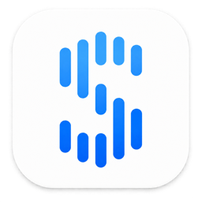
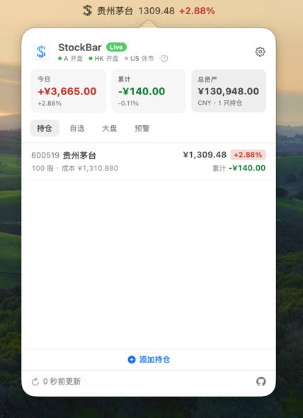

# StockBar

StockBar 是一款轻量的 macOS 菜单栏行情工具，让你无需打开完整的交易软件，也能随时查看关注的市场动态。



它常驻在菜单栏中，以紧凑的方式展示股票、指数、汇率和持仓盈亏。你可以根据自己的关注重点调整展示内容，并在价格达到目标时收到提醒。

## 界面示例



## 主要功能

- 支持 A 股、港股、美股、指数和汇率行情
- 在菜单栏快速查看行情，支持滚动、轮播、紧凑和极简模式
- 管理自选股和持仓，直观查看涨跌与盈亏
- 设置价格预警，及时关注重要波动
- 自定义涨跌颜色、快捷键和显示方式
- 支持隐私模式、中英文界面和登录时启动
- 支持数据导入、导出与备份恢复

## 系统要求

- macOS 13.0 或更高版本
- Apple Silicon 或 Intel Mac

## 安装

从 [GitHub Releases](https://github.com/septwong/StockBar/releases) 下载最新的 `StockBar-*.dmg`，将 StockBar 拖入“应用程序”。

当前发布版本尚未经过 Apple Developer ID 签名和公证。首次启动时请在 Finder 中右键 StockBar 并选择“打开”；如仍被拦截，请在“系统设置 → 隐私与安全”中选择“仍要打开”。

如果以上方法仍无法打开，请先确认 StockBar 安装包来自本项目的 GitHub Releases，然后打开“终端”，执行以下命令移除该应用的隔离属性，再重新启动 StockBar：

```bash
sudo xattr -rd com.apple.quarantine /Applications/StockBar.app
```

执行时需要输入当前 Mac 用户的登录密码；终端不会显示输入的密码或占位符，这是正常现象。该命令应仅用于上述明确的 StockBar 应用路径，请勿对“应用程序”目录或其他宽泛路径批量执行。

如果希望恢复旧版 macOS 中的“允许从任何来源安装应用”选项，可以在“终端”执行：

```bash
sudo spctl --master-disable
```

输入 Mac 登录密码后，打开“系统设置 → 隐私与安全性 → 安全性 → 允许以下来源的应用程序”，通常即可看到并选择“任何来源”。

这会降低 macOS 对所有下载应用的安全拦截能力。如果只是为了运行 StockBar，更建议使用上面的单独放行方式。之后如需恢复 macOS 默认的安全检查，请执行：

```bash
sudo spctl --master-enable
```

每个 Release 同时提供 `SHA256SUMS.txt`。可在终端中校验：

```bash
shasum -a 256 -c SHA256SUMS.txt
```

## 开始使用

启动 StockBar 后，它会显示在 macOS 菜单栏中。点击图标即可添加自选标的、记录持仓或调整显示方式；更多选项可在设置页面中配置。

## 隐私

StockBar 的数据保存在本机，不会读取或修改其他应用的数据。行情服务所需的 API Key 保存在 macOS 钥匙串中，不会写入数据库、备份或日志。

## 许可证

StockBar 采用 [MIT License](LICENSE)。第三方代码信息见 [THIRD_PARTY_NOTICES.md](THIRD_PARTY_NOTICES.md)。
